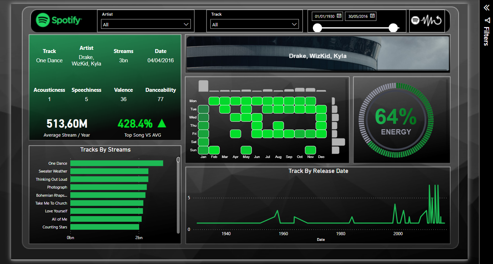

    <ul>
      
<h1 style="display: inline-block;"> Spotify PowerBI Dashboard </h1>

    </ul>

* Firstly, we downloaded the dataset from Kaggle. Subsequently, using Python, we initiated a preprocessing phase to ensure data quality. To enrich the dataset, a column with __album cover URLs__ was incorporated by connecting to the __Spotify for Developer API__, also through Python. 

* On the design front, we crafted a template in PowerPoint, experimenting with hues, transparencies, and lighting effects. This template was later imported into Power BI as the canvas background. 

* Finally, we create the necessary DAX measures in Power BI to achieve the desired KPIs. The most interesting thing for me, was the utilization of __Deneb__ to achieve the Unit Chart for "Energy" and the central __Heatmap__, drawing inspiration from GitHub. 

* Inspired by Ahmed Ashour & Park

# Contacts
For any inquiries or further information, please contact:
- **Name:** Hatim Lazim
- **Email:** hatimlazim.hl@gmail.com
- **LinkedIn:** <a href="https://ma.linkedin.com/in/hatim-lazim" target="_blank">Hatim Lazim</a> 
